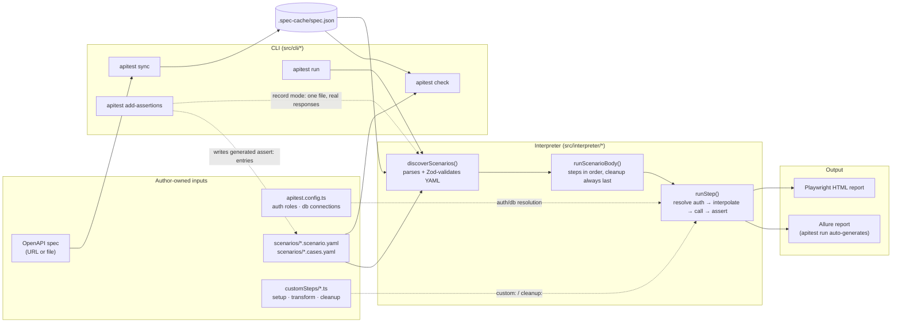
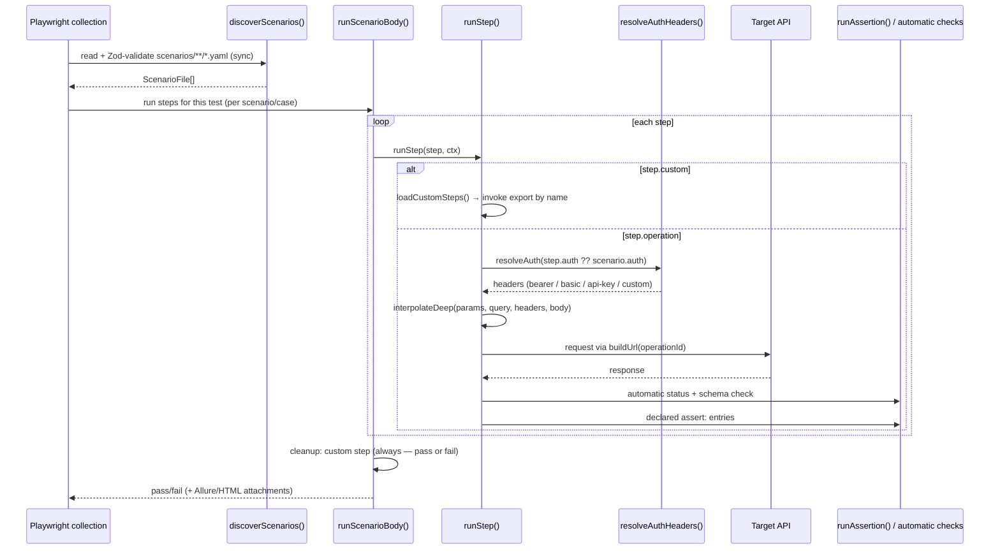

# apitest-framework

Contract-first, generic API test framework on Playwright. The OpenAPI spec is the
source of truth: scenarios reference operations by `operationId`, not hand-typed
URLs, and every response gets an automatic status/schema check derived from the
spec. See [Architecture](#architecture) below for how the pieces fit together.

## Quick start

```bash
npx create-apitest my-project
cd my-project
npm install
npx apitest sync && npx apitest check && npx apitest run
```

`create-apitest` scaffolds a new project with one small working example (a `listPosts` scenario
against jsonplaceholder.typicode.com) that runs immediately with no credentials — so the command
above passes out of the box, before you've written a single line of your own. See
[Examples](#examples) below for two fuller worked projects (a real multi-role, multi-tag test
suite, and a minimal CLI-trying sample) to study or copy from.

New here? See the [step-by-step walkthrough](#step-by-step-point-at-your-own-api--write-tests)
below for what each command actually does and what to fill in for your own API.

## Step-by-step: point at your own API → write tests

### 1. Point the framework at your API's OpenAPI spec

`apitest init` reads your spec, inspects its `securitySchemes`, and writes a best-effort
`apitest.config.ts` plus `environments/dev.env.example`:

```bash
npx apitest init --spec https://your-api.example.com/openapi.json
# or a local file:
npx apitest init --spec ./openapi.yaml
```

This overwrites `apitest.config.ts` and `environments/dev.env.example`. Review the generated
`auth.roles` — bearer-token, basic, and header api-key schemes are fully auto-configured; oauth2/
openIdConnect schemes are stubbed with a guessed (or `TODO`) login path and need a manual check
(`init`'s console output calls out every scheme it couldn't fully configure). A query-string
api-key scheme isn't auto-configurable at all — see `kind: "custom"` in `src/types/config.ts` for
writing your own `AuthStrategy` module.

If `init`'s guesses are wrong for your API (wrong login path, wrong `tokenPath`, extra roles you
need), hand-edit `apitest.config.ts` directly — it's a plain TypeScript object, see this repo's
own `apitest.config.ts` for a filled-in example with four `bearer-login` roles.

### 2. Fill in real credentials

```bash
cp environments/dev.env.example environments/dev.env
```

Edit `environments/dev.env` with real values for `BASE_URL` and whatever username/password/token/
api-key vars `init` listed. `environments/*.env` is git-ignored — only `*.env.example` is meant to
be committed. `apitest run --env <name>` loads `environments/<name>.env` (defaults to `dev`), so
different environments (`staging`, `prod`) are just additional `.env` files.

### 3. Sync the spec and validate

```bash
npx apitest sync    # fetches the spec, caches it to .spec-cache/spec.json
npx apitest check   # passes with zero scenarios authored — confirms the pipeline works end to end
```

Re-run `apitest sync` any time the target API's spec changes — `check`/`run` read the cached copy,
never the live spec, so a stale cache silently hides new/changed operations until you re-sync.

Before re-syncing over an existing cache, `apitest drift` diffs the live spec against
`.spec-cache/` and summarizes what changed in plain English — new/removed operations, new
required fields/params, removed documented status codes — split into breaking vs. informational,
each with the scenario files that reference the affected operation. It exits non-zero when a
breaking change is found (useful in CI), and never touches the cache unless you pass `--sync`:

```bash
npx apitest drift          # report only, cache untouched
npx apitest drift --sync   # report, then accept the live spec into .spec-cache/
```

### 4. Write your first scenario

Get YAML IntelliSense for free — either `npx apitest schema` once (regenerates
`schemas/scenario.schema.json`, already wired into `.vscode/settings.json`), or add
`# yaml-language-server: $schema=../schemas/scenario.schema.json` at the top of a scenario file.

Use the [`/add-scenario`](.claude/skills/add-scenario/SKILL.md) skill to scaffold one against a
real `operationId`, or hand-write one — minimal example:

```yaml
# scenarios/my-first.scenario.yaml
# yaml-language-server: $schema=../schemas/scenario.schema.json
name: my-first-flow
tags: [smoke]
auth: admin              # a role name from apitest.config.ts's auth.roles
steps:
  - name: list widgets
    operation: get_api-widgets   # an operationId from the synced spec
    assert:
      - status: 200
```

Don't know an `operationId` offhand? `.spec-cache/spec.json` (written by `sync`) lists every
operation the spec exposes, or run `npx apitest import` to scaffold one stub file per tag from the
whole spec as a starting point.

Full field reference (every step/assertion/auth/db field, with examples): 
[`docs/scenario-format.md`](docs/scenario-format.md). For anything a declarative `operation:` step
can't express (setup data, transforming an extracted value, guaranteed cleanup), add a typed
function under `customSteps/` — see [`docs/custom-steps.md`](docs/custom-steps.md) or the
[`/add-custom-step`](.claude/skills/add-custom-step/SKILL.md) skill.

### 5. Validate and run

```bash
npx apitest check              # operationIds/params exist in the synced spec — no requests sent
npx apitest run --dry-run      # prints the resolved plan (URLs, headers, bodies) — still no requests sent
npx apitest run                # actually executes it
npx apitest run --tag smoke    # only scenarios/cases tagged @smoke
```

`check` does **not** verify a `custom:` name resolves to a real export in `customSteps/` — only a
run does (see [`docs/custom-steps.md`](docs/custom-steps.md#errors-and-troubleshooting)).

After a run, `apitest digest` summarizes `allure-results/` into a plain-English pass/fail digest —
new failures vs. ones that were already failing last time vs. ones that just got fixed — instead
of re-reading the whole Allure report by hand. It only reads local Allure JSON (no network calls,
no credentials) and isolates the most recent run by clustering result files written close together
in time:

```bash
npx apitest digest
```

### 5b. Generating assertions from a live run

Every step already gets a free status/schema check — `assert:` is for asserting *specific* field
values. Writing those by hand means reading real response bodies and copying values into YAML.
`apitest add-assertions` does that for you: it runs one scenario/cases file live (same fixtures,
auth roles, chaining, and `cleanup:` as `apitest run`) and appends `assert:` entries derived from
the actual responses.

```bash
npx apitest add-assertions scenarios/auth/auth-me.scenario.yaml --dry-run   # preview, no write
npx apitest add-assertions scenarios/auth/auth-me.scenario.yaml            # writes the file
```

What it does and doesn't do:

- Only `operation:` steps get generated assertions — `custom:` steps still execute (so chained
  `extract:`ed vars work), but `assert:` never applies to them (see `runStep.ts`).
- A jsonpath you've already asserted on by hand is left alone, whatever operator you used —
  the generator only fills gaps.
- Fields that look like they change every request (`id`, `token`, timestamps, UUIDs) get
  `exists: true` instead of a brittle `equals:`; everything else gets `equals: <observed value>`.
  Non-empty arrays get `minLength: <observed length>` rather than an exact-length/contents match.
- A non-JSON response body (e.g. an HTML error page, a CSV export) is skipped with a note —
  nothing is guessed for it.
- These assertions encode whatever the live API returned *at generation time*, not necessarily
  what it *should* return — review the diff before committing, then run `apitest check` and
  `apitest run` to confirm they still pass.

### 6. Read the results

`apitest run` auto-generates a single-file Allure report after the run:

```bash
npm run allure:open     # opens allure-report/index.html
```

A Playwright HTML report (`playwright-report/`) and JUnit XML (`test-results/junit.xml`) are also
written every run — both are gitignored, regenerated-on-run artifacts, not something to hand-edit
or commit.

## Layout

This describes any apitest project (whether scaffolded by `create-apitest` or one of the
`examples/` below) — not just this repo, which is the framework itself plus its examples.

- `apitest.config.ts` — spec location, auth roles, db connections.
- `scenarios/*.scenario.yaml` — chained flows. `scenarios/*.cases.yaml` — independent edge cases.
  Full field reference: [`docs/scenario-format.md`](docs/scenario-format.md).
- `customSteps/*.ts` — typed escape hatch, looked up by export name from a step's `custom:` field
  (or a scenario's `cleanup:` field). See [`docs/custom-steps.md`](docs/custom-steps.md).
- `schemas/scenario.schema.json` — JSON Schema generated from the scenario Zod schema, for editor IntelliSense (see `.vscode/settings.json`).

In this repo specifically:

- `runtime/scenario.spec.ts` — the one generic Playwright spec file every project's `playwright.config.ts` points `testDir` at (resolved via the `apitest-framework/runtime/scenario.spec.ts` package export); it interprets scenario data and is never generated or hand-edited per API.
- `src/` — spec loader, scenario schema, interpreter, auth strategies, db adapters, CLI.
- `examples/` — worked example projects, see [Examples](#examples).

## Examples

- [`examples/assertquest/`](examples/assertquest/) — a full worked example against the SwiftCargo
  API (`https://assertquest.com/docs/json`): multiple auth roles, chained booking/fleet flows,
  `customSteps/`, a `queries/` library, db assertions, reliability/race-condition scenarios. Read
  its own [README](examples/assertquest/README.md) to run it.
- [`examples/petstore/`](examples/petstore/) — just the public Swagger Petstore OpenAPI doc, no
  scenarios; a minimal spec to point the CLI at when trying it out against something unrelated to
  the AssertQuest example.

## CLI

- `apitest init --spec <url|path>` — derive `apitest.config.ts` and an env example from a spec's `securitySchemes`.
- `apitest sync` — fetch and cache the spec (required before `run`/`check`; Playwright collects tests synchronously).
- `apitest check` — validate every scenario's `operationId`/params against the synced spec, without sending requests.
- `apitest run [--env] [--tag] [--dry-run]` — run scenarios via Playwright; auto-generates a single-file Allure report afterward.
- `apitest add-assertions <file> [--env] [--dry-run]` — run one scenario/cases file live and append `assert:` entries generated from its actual responses. See [below](#generating-assertions-from-a-live-run).
- `apitest import` — scaffold `*.scenario.yaml` stubs from the spec, one file per tag (never run automatically by `init`).
- `apitest schema` — regenerate `schemas/scenario.schema.json` for editor IntelliSense, from the same Zod schema that validates scenarios at load time.
- `apitest db:introspect --connection <name>` — generate typed row interfaces from a db connection's schema.

## Architecture

Everything downstream of the OpenAPI spec is generic — no code here is specific to any one API.
Scenarios describe *what* to call and *what to check*; the interpreter, spec cache, and the one
checked-in Playwright spec file (`runtime/scenario.spec.ts`) do the rest.



## How `apitest run` executes one step

Playwright must finish *registering* every `test()` call before any async work happens, so
`discoverScenarios()` reads and validates every scenario file synchronously at collection time —
that's why `apitest sync` has to run first and cache the spec to disk rather than fetching it live.



## Notes on this build

- The CLI runs TypeScript source directly via `tsx` (registered in `bin/*.js`, and re-registered via
  `NODE_OPTIONS="--import tsx/esm"` for the `npx playwright test` subprocess `apitest run` spawns — Node refuses to
  strip types from `.ts` files under `node_modules`, which `runtime/scenario.spec.ts` is once this package is a
  real dependency). There is no compiled `dist/`; `package.json`'s `exports` map points straight at `.ts` sources.
- DB adapters (`src/db/PostgresAdapter.ts`, `src/db/MssqlAdapter.ts`) implement the shared `DbAdapter` interface and
  are covered by a dialect-parameterized unit test suite; they have not been exercised against live SQL Server /
  Postgres containers in this environment.
- `apitest init`'s oauth2/openIdConnect handling stubs a `bearer-login` role with a guessed or TODO login path — it
  is intentionally not auto-configured end to end, per the design brief.
- No version of `apitest-framework` is published to npm yet — `examples/assertquest/package.json` depends on it via
  `file:../..` for local development. A published consumer would use a real semver range instead.
